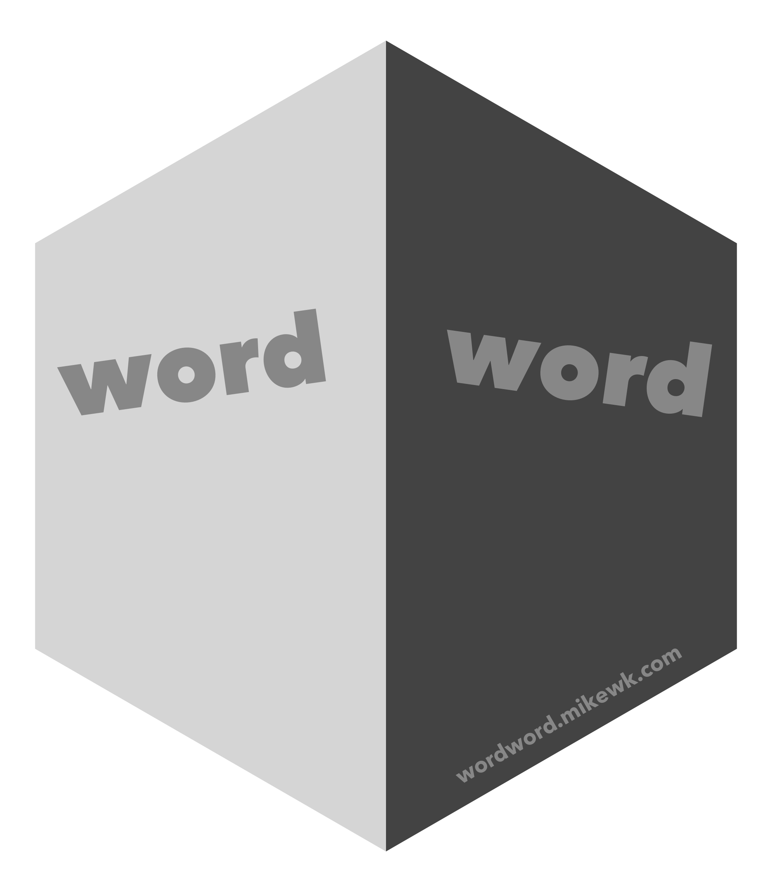

<!-- README.md is generated from README.Rmd. Please edit that file -->

```{r setup, include = FALSE}
knitr::opts_chunk$set(
  collapse = TRUE,
  comment = "#>",
  fig.path = "man/figures/README-",
  out.width = "100%"
)
library(magrittr)
```
# wordword 

[](https://www.tidyverse.org/lifecycle/#experimental)

>  =≠ A simple little thesaurus package.

## Installation

You can install the released version of wordword from [Github](https://github.com) with:

```{r, eval = FALSE}
devtools::install_github("mkearney/wordword")
```

## thesaurus.com

## `wordword::tuna()`

Access the unofficial API behind thesaurus.com:

```{r tuna}
wordword::tuna("intimate") %>%
  print(n = 30)
```

## bighugelabs.com

There's also access to bighugelab's words API (requires API key), but I ran 
through the limit on free requests in no time.

## `wordword::sameword()`

```{r, eval = FALSE}
wordword::sameword("intimate")
```

## `wordword::diffword()`

```{r, eval = FALSE}
wordword::diffword("intimate")
```
